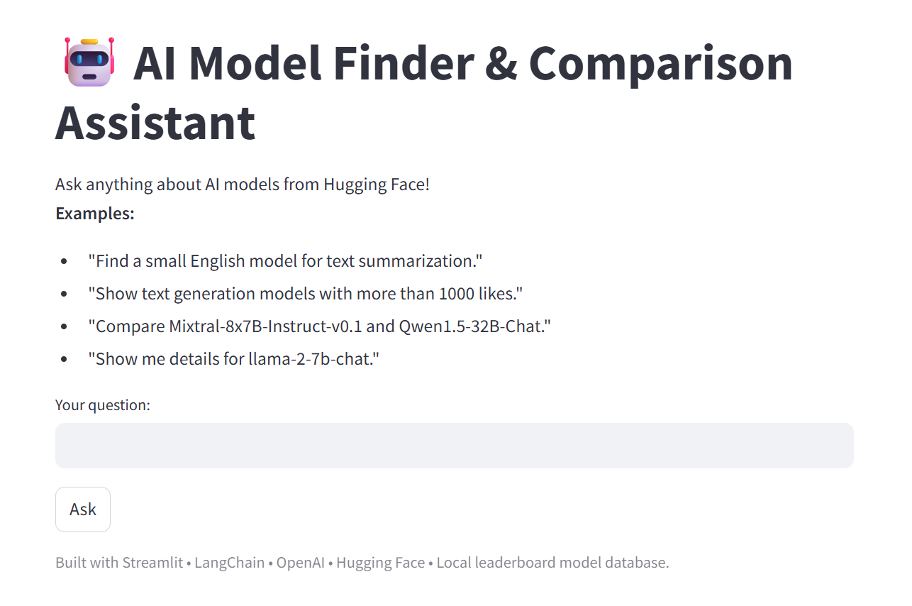

# ModelBoard: Agentic RAG for LLM Leaderboard Discovery

A modular conversational app for searching, filtering, and comparing top open-source large language models, powered by agentic RAG (retrieval-augmented generation) and a curated leaderboard database.

---

*Interactive semantic search and model comparison, powered by agentic RAG.*
  


---

## 🚀 Features

* **Conversational agentic interface** for model discovery, search, and comparison.
* **Semantic search** across curated leaderboard models (Open LLM Leaderboard, Hugging Face).
* **Advanced filtering** by task, tags, provider, license, benchmark score, parameter count, etc.
* **Model comparison** with detailed metadata, benchmark, and license info.
* **Tool-using agent** architecture (LangChain) with modular, extensible codebase.
* **Local, fast, and reproducible**: all model data indexed and embedded locally—no need to hit Hugging Face API at query time.
* **Streamlit web UI**—easy to run, easy to extend.

---

## 🛠️ Getting Started

### 1. Clone and install

```bash
git clone https://github.com/mrzarei5/ModelBoard.git
cd modelboard-agentic-rag

# Create and activate a conda environment
conda create -n modelboard python=3.10
conda activate modelboard

# Install requirementss
pip install -r requirements.txt
```

### 2. Set your API keys

**OpenAI API key (required)**

Create a `.env` file in the project root directory and add your OpenAI API key:

```ini
OPENAI_API_KEY=sk-...
```
**Hugging Face API key (optional)**

Add your Hugging Face API key (if wanted to be used for downloading leaderboard metadata):

```ini
HF_API_KEY=hf_...
```

### 3. (Optional) Update model leaderboard metadata

If you want to download the latest leaderboard data or refresh your model list, run:
```bash
python data/fetch_leaderboard.py
```
This will (re)generate `model_metadata.json` in the `data` folder.

### 4. Run the app

```bash
streamlit run main.py
```

---

## 🗂️ Example Queries

* *Show all chat models with Apache-2.0 license.*
* *Find a multilingual model for question answering.*
* *Compare meta-llama/Llama-2-70b-chat-hf and mistralai/Mistral-7B-Instruct-v0.3.*
* *Give me details about openchat/openchat-3.5-0106.*

---

## 📝 License

This project is licensed under the Apache License, Version 2.0.  
See the [LICENSE](LICENSE) file for details.

---

## 🤝 Acknowledgements

* [Hugging Face Open LLM Leaderboard](https://huggingface.co/spaces/HuggingFaceH4/open_llm_leaderboard)
* [LangChain](https://github.com/langchain-ai/langchain)
* [ChromaDB](https://www.trychroma.com/)
* [SentenceTransformers](https://www.sbert.net/)
* [Streamlit](https://streamlit.io/)